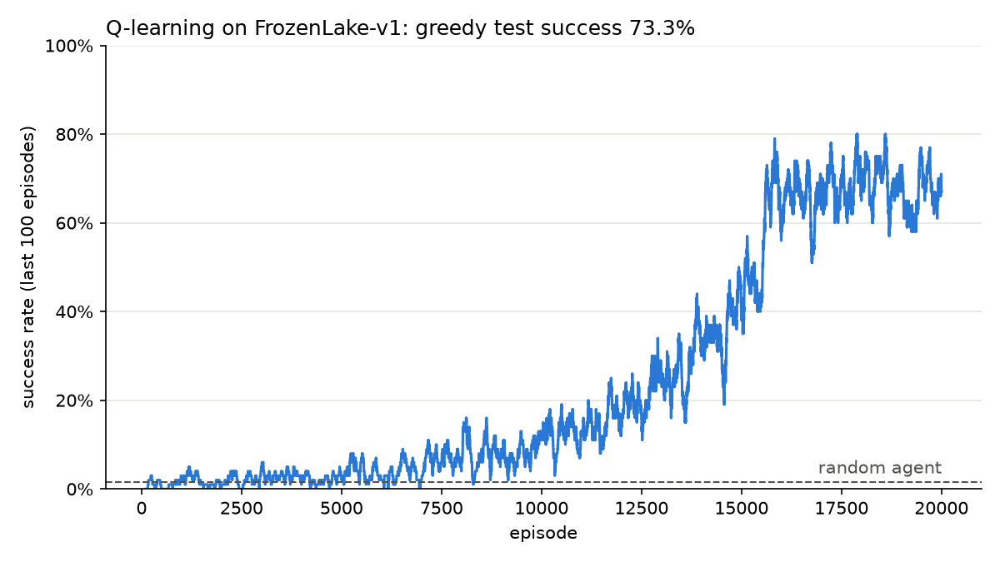

# rl_agents

Reinforcement learning agents written from scratch in Python with NumPy and Gymnasium. The first one is tabular Q-learning.

## Result: FrozenLake



On slippery FrozenLake-v1 (4x4), the agent trained for 20,000 episodes (seed 42). I then tested the greedy policy on 1,000 new games:

| Agent | Success rate |
|---|---|
| Random actions | about 1.5% |
| My Q-learning agent | 73.3% |
| Best possible policy | about 74% |

The ice is slippery: the agent moves in the chosen direction only 1/3 of the time and slides to one of the two sides otherwise. That is why even the best policy loses about a quarter of the games.

This is the policy it learned (H = hole, G = goal):

```
← ↑ ↑ ↑
← H ← H
↑ ↓ ← H
H → ↓ G
```

Many arrows point into a wall or away from the goal. When the agent pushes against a wall, the only possible slips are along the wall, so it never slides sideways into a hole. It takes longer, but it is much safer.

## How it works

- The agent keeps a table `Q[state, action]` with its estimate of the future reward for each move.
- After each step it updates one entry: `Q[s, a] += alpha * (r + gamma * max Q[s', :] - Q[s, a])`, with `alpha = 0.1` and `gamma = 0.99`.
- It picks moves with epsilon-greedy: a random move with probability epsilon, otherwise the best known move (ties are broken at random). Epsilon falls linearly from 1.0 to 0.01 over the first 80% of the episodes.
- Gymnasium ends an episode in two ways. `terminated` means the game really ended (hole or goal), so there is no future reward to add. `truncated` means it was stopped by a time limit, so the agent still counts the value of the next state. Mixing these up teaches the agent wrong values.

The code is in [src/rl_agents/q_learning.py](src/rl_agents/q_learning.py) (the agent) and [src/rl_agents/train.py](src/rl_agents/train.py) (the training loop).

## Quick start

```powershell
python -m venv .venv
.venv\Scripts\Activate.ps1
pip install -e .

python -m rl_agents.train
python -m rl_agents.plot results\FrozenLake-v1_seed42.npz
```

If PowerShell blocks `Activate.ps1`, run `Set-ExecutionPolicy -Scope CurrentUser RemoteSigned` once. On macOS or Linux, activate the environment with `source .venv/bin/activate` and use `/` in paths.

Training takes under a minute. `train` saves the Q-table and learning data to `results/`. `plot` saves the learning curve as a PNG next to it and prints the policy. Other options:

```powershell
python -m rl_agents.train --env Taxi-v4 --episodes 5000 --seed 1
```

## Results

| Environment | Episodes | Greedy test success (1,000 games) |
|---|---|---|
| FrozenLake-v1 (slippery) | 20,000 | 73.3% |
| Taxi-v4 | 5,000 | 100% |

Both with seed 42 and default settings.

## Roadmap

- [ ] Unit tests with pytest and a GitHub Actions workflow that runs them
- [ ] Save and load a trained agent, then serve it with FastAPI (separate repo: rl-agent-api)
- [ ] DQN and PPO with stable-baselines3 on CartPole and LunarLander
- [ ] A custom Gymnasium environment based on one of my own games
